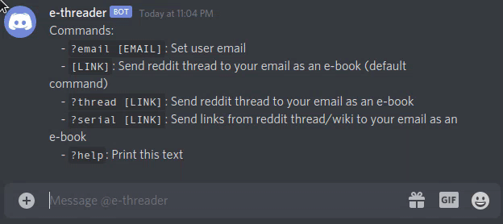

# e-threader

Send reddit threads to a kindle via a discord bot

### ... Why?

Reading on a screen sucks, but reading on an e-reader is pretty alright. I want to read more from the r/WritingPrompts and r/ShortStories communities, so I threw this together.  
I used a discord bot because it's easy to send a link with iOS's built-in share menu.

### How to use

1. Copy `.env.example` and fill in your own settings
2. Create empty sqlite file with `touch db.sqlite`
3. Start with `docker-compose up --build` (will take a WHILE to build, especially on a raspi)
4. React to "🙋" message in discord server
5. Set up account
6. DM bot to send books to kindle

### Commands

- `?email [EMAIL]`: Set user email
- `[LINK]`: Send reddit thread to your email as an e-book (default command)
- `?thread [LINK]`: Send reddit thread to your email as an e-book
- `?serial [LINK]`: Send links from reddit thread/wiki to your email as an e-book
- `?help`: Print help text

God help you if you try to look into this code, it's held together with duct-tape and dreams. 
